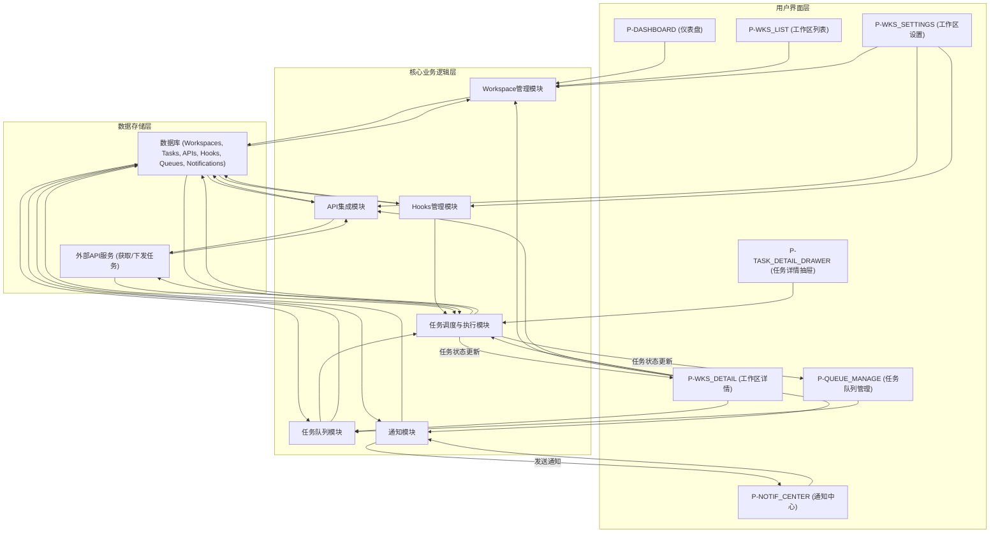
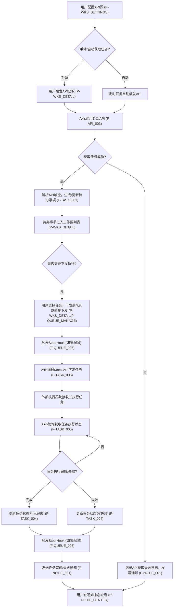
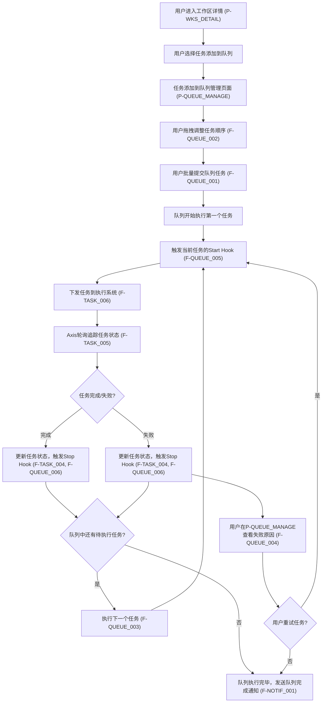
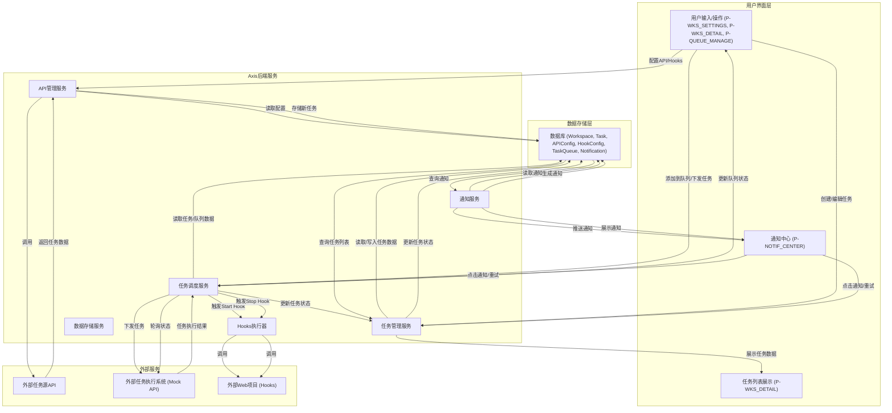

# Axis Web产品需求文档

## 1. 产品概述

### 1.1 产品名称与定位

*   **产品名称:** Axis
*   **产品定位:** Axis是一款专为个人开发者设计的Web端项目管理平台，旨在提供高效、自动化的多工作区待办事项管理能力，通过集成API实现任务的智能获取、下发与状态追踪，并支持灵活的任务队列和自定义钩子（Hooks），以提升开发者的项目管理效率和自动化水平。

### 1.2 产品应用语言

*   **产品应用语言:** 中文

### 1.3 产品愿景与目标

*   **产品愿景:** 成为个人开发者首选的、高度自动化和可定制化的项目及任务管理平台，让开发者能够专注于代码，而非繁琐的任务协调。
*   **产品目标:**
    1.  提供统一的工作区管理界面，使用户能清晰管理不同项目的目标和任务。
    2.  实现任务获取、下发、状态追踪的自动化，减少手动干预。
    3.  通过任务队列和可配置钩子，支持复杂的任务流程编排和批处理。
    4.  提供实时、有效的任务状态通知，帮助用户及时响应。
    5.  提升个人开发者在多项目并行开发时的效率和项目掌控力。

### 1.4 产品使用终端

*   **主要终端:** Web端桌面应用
*   **浏览器支持:** Chrome 90+、Firefox 88+、Safari 14+、Edge 90+
*   **分辨率支持:** 768x480及以上分辨率，最佳体验为1920x1080
*   **响应式适配:** 支持768px以上的所有桌面和平板设备

### 1.5 核心价值主张

*   **多工作区统一管理:** 集中管理和切换不同项目的待办事项，清晰定义项目目标。
*   **API驱动的任务自动化:** 智能获取外部任务并自动或手动下发执行，实现任务流的自动化。
*   **实时任务状态追踪:** 通过轮询机制和API结果，实时更新任务状态，确保项目进度透明。
*   **高效任务队列与钩子:** 支持任务队列批量提交、顺序执行，并允许通过Web项目自定义任务前置/后置操作，实现高度定制化工作流。
*   **即时通知与异常处理:** 任务完成或失败时即时通知，并支持失败任务的快速重试，提升异常处理效率。

### 1.6 目标用户群体分析

*   **主要用户:** 个人开发者
*   **用户画像:**
    *   独立负责或参与多个小型至中型项目的技术人员。
    *   对自动化工具和效率提升有强烈需求。
    *   熟悉API接口调用，倾向于通过编程方式解决重复性工作。
    *   需要一个统一平台来管理分散的任务和项目目标，避免信息孤岛。
    *   注重任务的执行顺序和流程控制。

### 1.7 市场需求与竞品简析

*   **市场需求:** 随着个人开发者承担项目复杂度的提升，对集成化、自动化、高度可定制的任务管理工具需求日益增长。传统的待办事项工具往往缺乏自动化集成和任务流编排能力，项目管理工具又过于庞大复杂，难以适应个人开发者的轻量化需求。Axis旨在填补这一空白，提供一个兼具灵活性和强大自动化能力的解决方案。
*   **竞品简析:**
    *   **传统To-Do List工具 (如Todoist, Microsoft To Do):** 界面简洁，易于上手，但缺乏多工作区项目目标管理、API自动化和任务队列/钩子等高级功能。
    *   **项目管理工具 (如Jira, Asana):** 功能强大，适合团队协作，但对于个人开发者而言过于重量级，配置复杂，且自动化能力多局限于内部集成，对外API交互能力有限。
    *   **自动化平台 (如Zapier, IFTTT):** 擅长工作流自动化，但缺乏核心的任务管理和追踪界面，通常作为辅助工具存在。
*   **Axis优势:** 专注于个人开发者，在任务管理的基础上深度融合API自动化、任务队列和自定义Hooks，提供一个轻量级但功能强大的综合解决方案，实现任务从“想到”到“执行”的无缝连接和自动化管理。

### 1.8 浏览器兼容性要求

*   **主流浏览器:** 完全兼容Chrome、Firefox、Safari、Edge最新稳定版本。
*   **兼容性测试:** 在主流浏览器及其主要历史版本上进行全面功能和性能测试，确保用户体验一致。

## 2. 功能规格

### 2.1 功能详述

### 2.1.1 工作区（Workspace）管理

| 功能ID | 功能名称 | 功能描述 | 优先级 |
|--------|---------|---------|--------|
| F-WKS_001 | 创建/编辑/删除工作区 | 用户可创建新的工作区，为每个工作区命名、设置项目描述和项目目标。支持对现有工作区进行编辑和删除操作。 | P0 |
| F-WKS_002 | 查看工作区列表与概览 | 在专门的页面展示所有工作区列表，包含每个工作区的名称、项目目标摘要、以及其下任务的汇总状态（如待处理、进行中、已完成任务数量）。 | P0 |
| F-WKS_003 | 设置/查看工作区项目目标 | 每个工作区可设置明确的项目目标，用于指导该工作区内的任务方向。用户可随时查看和修改项目目标。 | P0 |
| F-WKS_004 | 工作区元信息管理 | 提供独立的界面用于管理工作区的元信息，包括API配置（用于任务获取与下发）、Hooks配置（任务开始/结束钩子）、详细项目描述等。 | P0 |

### 2.1.2 API任务集成

| 功能ID | 功能名称 | 功能描述 | 优先级 |
|--------|---------|---------|--------|
| F-API_001 | 配置外部API源 | 用户可在工作区元信息页面配置用于获取待办事项的外部API接口，包括API URL、认证方式、请求方法等。 | P0 |
| F-API_002 | 配置API请求参数 | 支持为每个配置的API源设定请求参数，包括请求体、查询参数、请求头等，以满足不同API接口的要求。 | P0 |
| F-API_003 | 手动触发API获取任务 | 用户可手动触发配置好的API接口，即时获取外部待办事项，并将其导入到当前工作区任务列表中。 | P0 |
| F-API_004 | 自动定时API获取任务 | 支持设置自动定时从API获取待办事项的频率和时间点，实现任务的自动化导入。 | P0 |
| F-API_005 | 内置API源与参数适配 | 系统内置API源，并根据不同工作区接受特定的参数，用户无需从零开始配置API，只需提供特定参数即可使用。 | P0 |

### 2.1.3 任务管理

| 功能ID | 功能名称 | 功能描述 | 优先级 |
|--------|---------|---------|--------|
| F-TASK_001 | 添加/编辑/删除任务 | 用户可在工作区内手动创建、编辑和删除待办事项（任务），包括任务名称、描述、优先级、所属工作区、截止日期等。 | P0 |
| F-TASK_002 | 设置任务优先级 | 支持为每个任务设置不同的优先级（如高、中、低），以便用户管理和执行任务。 | P0 |
| F-TASK_003 | 查看任务列表 | 在工作区详情页展示任务列表，包含任务名称、当前状态、优先级、任务来源（API或手动创建）、创建/更新时间等关键信息。 | P0 |
| F-TASK_004 | 任务状态更新（手动/自动） | 用户可手动更新任务状态（如待执行、进行中、已完成、失败）。同时，系统根据API执行结果自动更新任务状态。 | P0 |
| F-TASK_005 | 轮询机制追踪任务状态 | 对于已下发的任务，系统通过轮询机制定期向执行系统查询任务的最新状态，并同步更新到Axis中。 | P0 |
| F-TASK_006 | API下发任务（Mock API） | 支持将Axis中的任务通过API下发到指定执行系统（初期可使用Mock API），实现任务的自动化执行。 | P0 |
| F-TASK_007 | 人工Check状态标识 | 任务列表显示“人工check状态”，表示该任务是否已被人为审核或确认。 | P0 |

### 2.1.4 任务队列与钩子

| 功能ID | 功能名称 | 功能描述 | 优先级 |
|--------|---------|---------|--------|
| F-QUEUE_001 | 创建任务队列与批量提交 | 用户可在任务列表中选择多个任务，创建任务队列，并支持批量提交到队列中进行顺序执行。 | P0 |
| F-QUEUE_002 | 任务队列执行顺序管理 | 支持在任务队列中拖拽调整任务的执行顺序，确保任务按预期流程依次完成。 | P0 |
| F-QUEUE_003 | 查看任务队列执行进度 | 提供任务队列的执行状态概览，实时显示队列中每个任务的当前状态（待执行、进行中、已完成、失败）和整体进度。 | P0 |
| F-QUEUE_004 | 失败任务查看与重试 | 当队列中有任务失败时，用户可方便地查看失败原因，并支持对失败任务进行重试操作或标记为已处理。 | P0 |
| F-QUEUE_005 | 配置Start Hook（Web项目） | 支持为单个任务配置Start Hook，即任务开始执行前自动调用一个指定的Web项目（提供URL和参数配置）。 | P0 |
| F-QUEUE_006 | 配置Stop Hook（Web项目） | 支持为单个任务配置Stop Hook，即任务执行完成后（无论成功或失败）自动调用一个指定的Web项目（提供URL和参数配置）。 | P0 |

### 2.1.5 通知管理

| 功能ID | 功能名称 | 功能描述 | 优先级 |
|--------|---------|---------|--------|
| F-NOTIF_001 | 任务完成/失败通知 | 当任务完成或失败时，系统发送通知（如站内信），告知用户任务的最终状态。 | P0 |
| F-NOTIF_002 | 通知中心列表 | 提供一个统一的通知中心页面，列表展示所有收到的通知，包括任务状态更新、系统提醒等。 | P0 |
| F-NOTIF_003 | 通知详情与快捷操作 | 通知中心中的每条通知都可点击查看详情。对于失败任务的通知，提供快捷操作按钮，如“重试”或“标记为已处理”。 | P0 |
| F-NOTIF_004 | 通知直达任务详情 | 点击通知可直接跳转到对应的任务详情页面，方便用户快速定位和处理问题。 | P0 |
| F-NOTIF_005 | 通知简要信息展示 | 在通知中心或弹窗通知中，可直接查看任务的简要结果，无需跳转到详情页即可了解核心信息。 | P0 |

### 2.2 功能模块间的关系图

## 3. 用户流程

### 3.1 用户旅程地图

| 阶段     | 用户行为                               | 用户感受                          | 痛点                                   | Axis解决方案                                                               |
|----------|----------------------------------------|-----------------------------------|----------------------------------------|----------------------------------------------------------------------------|
| **发现/规划** | 需要管理多个项目/工作内容，寻找效率工具 | 零散、效率低下、项目目标不清晰    | 缺乏统一平台，项目间切换成本高         | **P-DASHBOARD (仪表盘)** 提供多工作区概览，**P-WKS_LIST (工作区列表)** 集中管理 |
| **创建工作区** | 为新项目或工作内容创建工作区             | 掌控感、清晰                     | 如何定义项目目标，如何与任务关联       | **P-WKS_LIST** 创建工作区，**P-WKS_SETTINGS (工作区设置)** 定义项目目标与描述 |
| **获取任务**   | 获取外部系统或手动创建待办事项           | 省力、方便                        | 手动复制粘贴，遗漏任务，信息同步滞后   | **P-API_003 (手动触发API获取)** 或 **P-API_004 (自动定时API获取)** 任务；**F-TASK_001 (手动添加任务)** |
| **管理任务**   | 查看、编辑、分配任务，设置优先级         | 有序、重点突出                     | 任务繁多，优先级不明确，状态更新滞后   | **P-WKS_DETAIL (工作区详情)** 任务列表，**F-TASK_002 (设置任务优先级)**，**P-TASK_DETAIL_DRAWER (任务详情抽屉)** 编辑 |
| **执行任务**   | 将任务下发执行，或在队列中处理           | 自动化、流程化                     | 任务执行需要手动触发，无法批量处理     | **F-TASK_006 (API下发任务)**，**P-QUEUE_MANAGE (任务队列管理)** 批量执行 |
| **追踪反馈**   | 关注任务执行状态和结果                 | 实时、安心                        | 任务执行状态不透明，完成/失败不知晓    | **F-TASK_005 (轮询机制追踪)** 状态，**P-NOTIF_CENTER (通知中心)** 实时通知 |
| **处理异常**   | 任务失败后需要快速定位问题并重试         | 及时、解决问题                     | 失败原因难查找，重试流程复杂           | **F-QUEUE_004 (失败任务查看与重试)**，**F-NOTIF_003 (通知快捷操作)** |
| **复盘/优化**  | 定期审视项目进度和任务流程               | 改进、提升                         | 缺乏全局视角，难以发现流程瓶颈         | **P-DASHBOARD** 概览，**P-WKS_DETAIL** 任务列表和队列状态 |

### 3.2 关键业务流程图

#### 3.2.1 任务获取与执行流程

#### 3.2.2 任务队列管理流程

### 3.3 各场景下的用户操作步骤

1.  **每日工作开始前规划**
    *   用户登录Axis，进入**仪表盘 (P-DASHBOARD)**。
    *   查看所有工作区的任务汇总和状态，快速了解整体项目进度。
    *   点击进入特定**工作区详情 (P-WKS_DETAIL)**，查看当前工作区的任务列表，根据优先级重新安排任务。
2.  **在不同项目间切换时**
    *   通过左侧导航栏或**工作区列表 (P-WKS_LIST)**，快速切换到需要处理的另一个工作区。
    *   进入目标**工作区详情 (P-WKS_DETAIL)**，即时获取该工作区的任务列表和项目目标。
3.  **遇到新任务需要分配到特定项目时**
    *   用户进入对应的**工作区详情 (P-WKS_DETAIL)**。
    *   点击“添加任务”按钮，手动创建新任务，并设置优先级、描述等信息。
    *   或者，如果新任务来自外部系统，则在**工作区设置 (P-WKS_SETTINGS)** 中配置好API源，然后手动或自动获取任务到当前工作区。
4.  **通过API获取和下发待办事项**
    *   进入特定**工作区详情 (P-WKS_DETAIL)**，点击进入**工作区设置 (P-WKS_SETTINGS)** 页面。
    *   配置内置API源所需的参数，或配置新的外部API源。
    *   返回**工作区详情 (P-WKS_DETAIL)**，点击“手动获取任务”按钮，从API获取任务。
    *   审核新获取的任务，点击任务列表中的“下发”按钮，将任务通过Mock API下发执行。
5.  **创建和管理任务队列**
    *   在**工作区详情 (P-WKS_DETAIL)** 的任务列表中，通过多选框选择多个待执行任务。
    *   点击“添加到队列”按钮，进入**任务队列管理页 (P-QUEUE_MANAGE)**。
    *   在队列中，通过拖拽方式调整任务的执行顺序。
    *   点击“启动队列”按钮，系统按序执行任务，并在页面中实时显示每个任务的状态和总进度。
    *   如果队列中有任务失败，点击失败任务可查看原因，并选择“重试”或“标记为已处理”。
6.  **任务完成或失败时收到通知**
    *   顶部导航栏的通知图标显示未读通知数量，或系统弹出通知。
    *   点击通知图标或弹窗，进入**通知中心 (P-NOTIF_CENTER)**。
    *   在通知列表中，快速查看任务的简要结果。
    *   对于失败任务的通知，点击通知中的“重试”按钮，直接重新执行该任务；或点击通知跳转到**任务详情抽屉 (P-TASK_DETAIL_DRAWER)**，查看详细信息。

## 4. 数据流设计

### 4.1 数据结构与关系

*   **用户 (User):**
    *   `id` (PK)
    *   `username`
    *   `password_hash`
    *   `email`
    *   `created_at`
    *   `updated_at`
*   **工作区 (Workspace):**
    *   `id` (PK)
    *   `user_id` (FK to User)
    *   `name`
    *   `description`
    *   `project_goal`
    *   `created_at`
    *   `updated_at`
*   **任务 (Task):**
    *   `id` (PK)
    *   `workspace_id` (FK to Workspace)
    *   `title`
    *   `description`
    *   `status` (待执行, 进行中, 已完成, 失败)
    *   `priority` (高, 中, 低)
    *   `source` (API, Manual)
    *   `api_task_id` (如果来自API，关联外部ID)
    *   `manual_check_status` (待检查, 已检查)
    *   `created_at`
    *   `updated_at`
*   **API配置 (APIConfig):**
    *   `id` (PK)
    *   `workspace_id` (FK to Workspace)
    *   `type` (Fetch, Dispatch)
    *   `name` (如：Jira任务获取API)
    *   `url`
    *   `method` (GET, POST, etc.)
    *   `headers` (JSON)
    *   `params` (JSON)
    *   `auth_type`
    *   `auth_credentials` (加密存储)
    *   `auto_fetch_enabled` (boolean)
    *   `fetch_interval_cron` (如果自动获取启用)
    *   `created_at`
    *   `updated_at`
*   **钩子配置 (HookConfig):**
    *   `id` (PK)
    *   `task_id` (FK to Task, 可空，表示全局或工作区级钩子)
    *   `workspace_id` (FK to Workspace, 可空，表示全局或任务级钩子)
    *   `type` (Start, Stop)
    *   `hook_url` (Web项目URL)
    *   `method`
    *   `headers` (JSON)
    *   `params` (JSON)
    *   `created_at`
    *   `updated_at`
*   **任务队列 (TaskQueue):**
    *   `id` (PK)
    *   `workspace_id` (FK to Workspace)
    *   `name`
    *   `status` (待执行, 执行中, 已完成, 失败)
    *   `created_at`
    *   `updated_at`
*   **队列任务关联 (QueueTask):**
    *   `id` (PK)
    *   `queue_id` (FK to TaskQueue)
    *   `task_id` (FK to Task)
    *   `order_index` (队列中顺序)
    *   `status` (待执行, 执行中, 已完成, 失败) - 队列中任务的独立状态
    *   `execution_log` (执行日志，失败原因等)
*   **通知 (Notification):**
    *   `id` (PK)
    *   `user_id` (FK to User)
    *   `type` (Task_Completion, Task_Failure, System_Alert)
    *   `title`
    *   `content` (简要信息)
    *   `related_task_id` (FK to Task, 可空)
    *   `is_read` (boolean)
    *   `action_data` (JSON, 如重试任务的参数)
    *   `created_at`

### 4.2 关键数据流向图

### 4.3 数据存储与处理原则

1.  **安全性:**
    *   所有用户敏感数据（如API凭证）必须加密存储。
    *   所有API调用应通过HTTPS进行，确保数据传输安全。
    *   实施严格的权限控制，确保用户只能访问和操作其所属的工作区和任务。
2.  **数据一致性:**
    *   任务状态更新、队列状态变更等核心业务逻辑应采用事务处理，确保数据一致性。
    *   轮询机制应处理网络延迟和异常情况，避免脏数据。
3.  **可扩展性:**
    *   数据库设计应考虑未来功能扩展，如增加更多任务属性、集成更多外部服务。
    *   API配置和Hooks配置应设计为通用且可扩展的结构，方便支持不同类型的接口和Web项目。
4.  **可追溯性:**
    *   所有关键操作（如任务创建、状态变更、队列执行）应记录操作日志，便于问题排查和审计。
    *   任务失败原因、API调用错误等信息应详细记录，方便用户排查和重试。
5.  **性能优化:**
    *   对于大量任务列表和队列，应采用分页加载、索引优化等技术，确保界面响应速度。
    *   API轮询频率应可配置，避免对外部服务造成过大压力，同时保证状态更新及时性。

## 5. 页面规格

### 5.1 页面概览

#### 5.1.1 整体布局架构

*   **布局模式:** Web端响应式布局 - 顶部导航栏 + 左侧菜单 + 主内容区(最小720px) + 可选右侧抽屉
*   **空间分配策略:**
    *   顶部导航栏：固定高度60px，包含Logo、全局功能入口（如通知中心）。
    *   左侧菜单：展开时宽度200-240px，折叠时宽度48-56px，负责模块导航。
    *   主内容区：动态宽度，占据剩余空间，最小宽度720px。
    *   右侧抽屉：宽度280-320px，在特定场景（如任务详情）时浮动覆盖主内容区一部分。
*   **导航体系:**
    *   **顶部主导航:** 用于全局功能（如通知、用户设置）和快速切换核心模块。
    *   **左侧功能菜单:** 提供工作区、仪表盘、队列管理等核心模块的导航，支持折叠/展开。
    *   **面包屑导航:** 在层级较深的页面提供导航路径，方便用户回溯。
*   **交互模式:**
    *   **页面切换:** 通过左侧菜单或内部链接进行主内容区的切换或整页跳转。
    *   **右侧抽屉:** 用于展示详情或编辑表单，如任务详情编辑。
    *   **模态弹窗:** 用于二次确认、轻量级表单填写（如创建工作区）。
    *   **右键菜单:** 在列表项上提供快捷操作。
*   **右侧面板使用:** 本产品将使用右侧抽屉模式来展示任务详情，其性质是浮动覆盖主内容区一部分，而非占据独立布局空间，以规避严格的右侧面板布局约束，同时提供良好的详情查看和编辑体验。

#### 5.1.2 页面列表

| 页面ID           | 页面名称           | 核心功能                                     | 布局类型 | 右侧面板/抽屉 |
|------------------|--------------------|----------------------------------------------|----------|---------------|
| P-DASHBOARD      | 仪表盘             | 所有工作区任务汇总和状态概览                 | 二栏布局 | 无            |
| P-WKS_LIST       | 工作区列表         | 创建、编辑、删除、查看所有工作区             | 二栏布局 | 无            |
| P-WKS_DETAIL     | 工作区详情         | 特定工作区任务列表、快速操作、跳转设置/队列 | 二栏布局 | 任务详情抽屉  |
| P-WKS_SETTINGS   | 工作区设置         | 配置工作区元信息、API、Hooks、项目目标       | 二栏布局 | 无            |
| P-QUEUE_MANAGE   | 任务队列管理       | 创建、编辑、启动、监控任务队列               | 二栏布局 | 无            |
| P-TASK_DETAIL_DRAWER | 任务详情抽屉       | 查看和编辑单个待办事项的详细信息             | 抽屉模式 | 抽屉          |
| P-NOTIF_CENTER   | 通知中心           | 查看所有通知，进行快捷操作                   | 二栏布局 | 无            |

### 5.2 页面详情

#### 5.2.1 仪表盘（P-DASHBOARD）

**布局架构设计：**
- 页面类型：概览页
- 布局模式：二栏布局
- 空间分配：左侧菜单 + 主内容区，主内容区采用卡片和列表组合布局，展示多工作区概览数据。

**页面布局架构：**
- 顶部导航栏：Logo、全局通知入口、用户头像/设置入口 - 建议高度60px，固定定位
- 左侧菜单：主导航菜单，显示“仪表盘”、“工作区列表”等 - 建议宽度200-240px(展开)/48-56px(折叠)
- 主内容区域：核心展示区域，建议最小宽度720px
  - 页面头部：标题“仪表盘”，欢迎语 - 建议高度48px
  - 内容展示区域：
    - 上部：多工作区任务概览卡片，显示每个工作区的活跃任务数、已完成任务数、项目目标摘要。卡片可点击进入对应工作区详情。
    - 下部：近期任务活动列表，显示最近完成/失败的任务、系统通知摘要。
  - 分页区域：如需展示大量活动日志，可包含分页控件。

**响应式适配策略：**
- 大屏幕(≥1440px)：二栏布局，左侧200-240px + 主内容区充满剩余空间。内容卡片可2-3列布局。
- 中屏幕(1200-1439px)：二栏布局，左侧200-240px + 主内容区充满剩余空间。内容卡片2列布局。
- 小屏幕(768-1199px)：左侧菜单折叠或抽屉式，主内容区卡片1-2列布局。
- 移动端(<768px)：单栏布局，左侧菜单抽屉式，内容单列显示。

**组件尺寸规范：**
- 按钮尺寸：标准按钮高度32px。
- 卡片高度：任务概览卡片建议高度120-160px，宽度自适应。
- 表格行高：列表数据建议36px。
- 图标尺寸：20px。
- 间距规范：卡片间距16px，区域间距24px。

**核心功能：**
展示所有工作区的任务汇总和状态概览，提供快速进入各工作区详情的入口，展示近期任务活动。

**交互设计：**
- 鼠标交互：工作区概览卡片悬停高亮，点击跳转到P-WKS_DETAIL。
- 键盘交互：Tab键导航，Enter键激活链接。
- 状态管理：用户偏好（如卡片排序）保持。

**页面间跳转关系：**
| 触发组件       | 交互类型 | 目标页面         | 传递参数 | 展示方式   |
|----------------|----------|------------------|----------|------------|
| 工作区概览卡片 | 点击     | 工作区详情（P-WKS_DETAIL） | Workspace ID | 主内容区切换 |
| 通知图标       | 点击     | 通知中心（P-NOTIF_CENTER） | 无       | 主内容区切换 |

#### 5.2.2 工作区列表页（P-WKS_LIST）

**布局架构设计：**
- 页面类型：列表页
- 布局模式：二栏布局
- 空间分配：左侧菜单 + 主内容区，主内容区以表格形式展示工作区列表。

**页面布局架构：**
- 顶部导航栏：Logo、全局通知入口、用户头像/设置入口 - 建议高度60px，固定定位
- 左侧菜单：主导航菜单，突出显示“工作区列表” - 建议宽度200-240px(展开)/48-56px(折叠)
- 主内容区域：核心展示区域，建议最小宽度720px
  - 页面头部：标题“工作区列表”，右侧包含“创建工作区”按钮 - 建议高度48px
  - 工具栏区域：搜索框（按名称搜索），筛选器（按状态筛选） - 建议高度40px
  - 内容展示区域：工作区列表表格
  - 分页区域：分页控件，显示总数、每页条数选择 - 建议高度40px

**响应式适配策略：**
- 大屏幕(≥1440px)：二栏布局，左侧200-240px + 主内容区充满剩余空间。表格列宽可调整。
- 中屏幕(1200-1439px)：二栏布局，左侧200-240px + 主内容区充满剩余空间。表格列可隐藏部分次要信息。
- 小屏幕(768-1199px)：左侧菜单折叠或抽屉式，表格内容可横向滚动或部分列折叠显示。
- 移动端(<768px)：单栏布局，左侧菜单抽屉式，表格转为卡片列表形式。

**组件尺寸规范：**
- 按钮尺寸：标准按钮高度32px。
- 输入框：搜索框高度32px。
- 表格行高：36px。
- 图标尺寸：16px。
- 间距规范：组件间距8-12px，区域间距16px。

**核心功能：**
管理所有工作区的创建、编辑、删除操作，展示工作区列表和基本信息。

**数据结构：**
| 列名         | 数据类型 | 宽度建议 | 是否可排序 | 操作功能                 |
|--------------|----------|----------|----------|--------------------------|
| 工作区名称   | 文本     | 200px    | 是       | 点击进入详情（P-WKS_DETAIL） |
| 项目目标     | 文本     | 300px    | 否       | -                        |
| 活跃任务     | 数字     | 80px     | 是       | -                        |
| 已完成任务   | 数字     | 80px     | 是       | -                        |
| 创建时间     | 日期时间 | 150px    | 是       | -                        |
| 操作         | 按钮组   | 120px    | 否       | 编辑/删除（弹窗确认）    |

**交互设计：**
- 鼠标交互：表格行悬停高亮，操作按钮悬停显示提示。
- 键盘交互：Tab键导航，Enter键确认。
- 状态管理：搜索和筛选条件保持。

**页面间跳转关系：**
| 触发组件       | 交互类型 | 目标页面       | 传递参数     | 展示方式 |
|----------------|----------|----------------|--------------|----------|
| “创建工作区”按钮 | 点击     | 创建工作区表单 | 无           | 模态弹窗 |
| 工作区名称     | 点击     | 工作区详情（P-WKS_DETAIL） | Workspace ID | 主内容区切换 |
| “编辑”按钮     | 点击     | 编辑工作区表单 | Workspace ID | 模态弹窗 |
| “删除”按钮     | 点击     | 删除确认弹窗   | Workspace ID | 模态弹窗 |

#### 5.2.3 工作区详情页（P-WKS_DETAIL）

**布局架构设计：**
- 页面类型：列表页/操作中心
- 布局模式：二栏布局 + 可选右侧抽屉
- 空间分配：左侧菜单 + 主内容区（任务列表为主），右侧抽屉用于任务详情。

**页面布局架构：**
- 顶部导航栏：Logo、全局通知入口、用户头像/设置入口 - 建议高度60px，固定定位
- 左侧菜单：主导航菜单，突出显示当前工作区 - 建议宽度200-240px(展开)/48-56px(折叠)
- 主内容区域：核心展示区域，建议最小宽度720px
  - 页面头部：工作区名称、面包屑导航、项目目标摘要、以及“工作区设置”、“任务队列管理”、“手动获取任务”、“添加任务”等操作按钮 - 建议高度60px
  - 工具栏区域：任务搜索框、筛选器（按状态、优先级、来源）、批量操作（如添加到队列、批量删除） - 建议高度48px
  - 内容展示区域：任务列表表格，展示每个任务的名称、优先级、完成状态（及队列状态）、人工check状态。
  - 分页区域：任务列表分页控件 - 建议高度40px
- 右侧抽屉（P-TASK_DETAIL_DRAWER）：**仅在用户点击任务列表项时弹出**，浮动覆盖主内容区一部分，用于显示和编辑任务详情。宽度280-320px。

**响应式适配策略：**
- 大屏幕(≥1440px)：二栏布局，左侧200-240px + 主内容区(≥720px)。当右侧抽屉弹出时，主内容区保持最小宽度，抽屉浮动覆盖。
- 中屏幕(1200-1439px)：二栏布局，左侧200-240px + 主内容区充满剩余空间。右侧抽屉弹出时，主内容区会动态调整宽度。
- 小屏幕(768-1199px)：左侧菜单折叠或抽屉式，任务列表可横向滚动或部分列折叠。右侧抽屉弹出时，可全屏显示或调整宽度。
- 移动端(<768px)：单栏布局，左侧菜单抽屉式，任务列表转为卡片列表。右侧抽屉全屏显示。

**组件尺寸规范：**
- 按钮尺寸：标准按钮高度32px，主要操作按钮36px。
- 输入框：搜索框高度32px。
- 表格行高：36px。
- 图标尺寸：16-20px。
- 间距规范：组件间距8-12px，区域间距16-20px。

**核心功能：**
展示特定工作区下的任务列表，提供任务的增删改查、优先级设置、状态管理；提供进入工作区设置、任务队列管理和手动获取任务的入口。点击任务列表项可打开任务详情抽屉。

**数据结构：**
| 列名         | 数据类型     | 宽度建议 | 是否可排序 | 操作功能                       |
|--------------|--------------|----------|----------|--------------------------------|
| 任务名称     | 文本+链接    | 250px    | 是       | 点击打开任务详情抽屉（P-TASK_DETAIL_DRAWER） |
| 优先级       | 标签/图标    | 80px     | 是       | -                              |
| 当前状态     | 标签/图标    | 100px    | 是       | -                              |
| 队列状态     | 标签/图标    | 100px    | 是       | -                              |
| 人工Check状态 | 标签/勾选框  | 100px    | 是       | -                              |
| 任务来源     | 文本         | 80px     | 是       | -                              |
| 创建时间     | 日期时间     | 150px    | 是       | -                              |
| 操作         | 按钮组/图标组 | 120px    | 否       | 编辑/删除/下发/重试（如失败） |

**交互设计：**
- 鼠标交互：任务列表行悬停高亮，点击任务名称或行打开右侧任务详情抽屉。批量操作按钮悬停显示提示。
- 键盘交互：Tab键导航，Enter键激活操作。
- 状态管理：筛选条件、搜索关键词保持。

**页面间跳转关系：**
| 触发组件           | 交互类型 | 目标页面               | 传递参数     | 展示方式   |
|--------------------|----------|------------------------|--------------|------------|
| “工作区设置”按钮   | 点击     | 工作区设置（P-WKS_SETTINGS） | Workspace ID | 主内容区切换 |
| “任务队列管理”按钮 | 点击     | 任务队列管理（P-QUEUE_MANAGE） | Workspace ID | 主内容区切换 |
| “手动获取任务”按钮 | 点击     | 当前页面（触发API） | Workspace ID | 局部刷新   |
| “添加任务”按钮     | 点击     | 创建任务表单           | Workspace ID | 模态弹窗   |
| 任务列表行/任务名称 | 点击     | 任务详情抽屉（P-TASK_DETAIL_DRAWER） | Task ID      | 右侧抽屉   |
| “编辑”任务操作     | 点击     | 任务详情抽屉（P-TASK_DETAIL_DRAWER） | Task ID      | 右侧抽屉   |
| “删除”任务操作     | 点击     | 删除确认弹窗           | Task ID      | 模态弹窗   |
| “下发”任务操作     | 点击     | 确认下发弹窗           | Task ID      | 模态弹窗   |

#### 5.2.4 工作区设置页（P-WKS_SETTINGS）

**布局架构设计：**
- 页面类型：表单页/配置页
- 布局模式：二栏布局
- 空间分配：左侧菜单 + 主内容区，主内容区以表单和配置项为主。

**页面布局架构：**
- 顶部导航栏：Logo、全局通知入口、用户头像/设置入口 - 建议高度60px，固定定位
- 左侧菜单：主导航菜单，突出显示当前工作区，可能包含子菜单如“基本设置”、“API配置”、“Hooks配置” - 建议宽度200-240px(展开)/48-56px(折叠)
- 主内容区域：核心展示区域，建议最小宽度720px
  - 页面头部：标题“工作区设置：[工作区名称]”，面包屑导航 - 建议高度48px
  - 内容展示区域：
    - **基本信息区:** 工作区名称、项目描述、项目目标编辑表单。
    - **API配置区:** 列出已配置的API源，支持新增、编辑、删除API配置项，包括URL、参数、认证等。
    - **Hooks配置区:** 列出已配置的Start/Stop Hooks，支持新增、编辑、删除Hook配置项，包括Hook URL、参数、触发条件。
  - 底部：保存、取消按钮。

**响应式适配策略：**
- 大屏幕(≥1440px)：二栏布局，左侧200-240px + 主内容区充满剩余空间。配置项可多列排布。
- 中屏幕(1200-1439px)：二栏布局，左侧200-240px + 主内容区充满剩余空间。配置项单列排布。
- 小屏幕(768-1199px)：左侧菜单折叠或抽屉式，内容表单单列显示。
- 移动端(<768px)：单栏布局，左侧菜单抽屉式，内容单列显示。

**组件尺寸规范：**
- 按钮尺寸：标准按钮高度32px。
- 输入框：高度32px。
- 文本域：高度自适应。
- 图标尺寸：16px。
- 间距规范：表单项间距12-16px，区域间距20px。

**核心功能：**
查看和编辑工作区的基本信息、API配置和Hooks配置。

**交互设计：**
- 鼠标交互：表单输入框聚焦高亮，按钮悬停效果。
- 键盘交互：Tab键在表单项间切换，Enter键提交表单。
- 状态管理：表单未保存提示。

**页面间跳转关系：**
| 触发组件       | 交互类型 | 目标页面         | 传递参数 | 展示方式   |
|----------------|----------|------------------|----------|------------|
| “保存”按钮     | 点击     | 工作区详情（P-WKS_DETAIL） | Workspace ID | 主内容区切换 |
| “取消”按钮     | 点击     | 工作区详情（P-WKS_DETAIL） | Workspace ID | 主内容区切换 |
| “新增API”按钮  | 点击     | API配置表单      | 无           | 模态弹窗   |
| “编辑API”按钮  | 点击     | API配置表单      | APIConfig ID | 模态弹窗   |
| “新增Hook”按钮 | 点击     | Hook配置表单     | 无           | 模态弹窗   |
| “编辑Hook”按钮 | 点击     | Hook配置表单     | HookConfig ID | 模态弹窗   |

#### 5.2.5 任务队列管理页（P-QUEUE_MANAGE）

**布局架构设计：**
- 页面类型：列表页/管理页
- 布局模式：二栏布局
- 空间分配：左侧菜单 + 主内容区，主内容区以队列列表和队列详情为主。

**页面布局架构：**
- 顶部导航栏：Logo、全局通知入口、用户头像/设置入口 - 建议高度60px，固定定位
- 左侧菜单：主导航菜单，突出显示“任务队列管理” - 建议宽度200-240px(展开)/48-56px(折叠)
- 主内容区域：核心展示区域，建议最小宽度720px
  - 页面头部：标题“任务队列管理”，面包屑导航 - 建议高度48px
  - 工具栏区域：搜索框（按队列名称）、筛选器（按队列状态） - 建议高度40px
  - 内容展示区域：
    - 上部：任务队列列表，显示队列名称、状态、进度、创建时间、操作。
    - 下部（选中队列后显示）：选中队列的任务列表，显示队列中每个任务的名称、状态、执行顺序、失败原因（如有）。
  - 分页区域：队列列表分页控件 - 建议高度40px

**响应式适配策略：**
- 大屏幕(≥1440px)：二栏布局，左侧200-240px + 主内容区充满剩余空间。队列列表和队列任务列表可同时显示。
- 中屏幕(1200-1439px)：二栏布局，左侧200-240px + 主内容区充满剩余空间。队列列表和队列任务列表可能需要切换显示或折叠。
- 小屏幕(768-1199px)：左侧菜单折叠或抽屉式，列表可横向滚动或部分列折叠。
- 移动端(<768px)：单栏布局，左侧菜单抽屉式，列表转为卡片列表。

**组件尺寸规范：**
- 按钮尺寸：标准按钮高度32px。
- 输入框：搜索框高度32px。
- 表格行高：36px。
- 图标尺寸：16-20px。
- 间距规范：组件间距8-12px，区域间距16-20px。

**核心功能：**
创建任务队列，支持批量提交任务；设置任务在队列中的执行顺序（拖拽）；查看任务队列的执行进度，包括每个任务的状态；当队列中有任务失败时，方便查看失败原因并进行重试。

**数据结构：**
**任务队列列表：**
| 列名         | 数据类型 | 宽度建议 | 是否可排序 | 操作功能         |
|--------------|----------|----------|----------|------------------|
| 队列名称     | 文本     | 200px    | 是       | 点击查看队列详情 |
| 状态         | 标签     | 100px    | 是       | -                |
| 进度         | 进度条   | 150px    | 否       | -                |
| 创建时间     | 日期时间 | 150px    | 是       | -                |
| 操作         | 按钮组   | 120px    | 否       | 启动/暂停/删除   |

**队列中任务列表（选中队列后显示）：**
| 列名         | 数据类型     | 宽度建议 | 是否可排序 | 操作功能           |
|--------------|--------------|----------|----------|--------------------|
| 任务名称     | 文本+链接    | 250px    | 否       | 点击打开任务详情抽屉 |
| 顺序         | 数字（可拖拽） | 60px     | 否       | 拖拽调整顺序       |
| 状态         | 标签/图标    | 100px    | 是       | -                  |
| 失败原因     | 文本（气泡提示） | 200px    | 否       | -                  |
| 操作         | 按钮组/图标组 | 100px    | 否       | 重试/移除          |

**交互设计：**
- 鼠标交互：队列列表行悬停高亮，点击队列名称展开队列中任务列表。队列中任务支持拖拽调整顺序。
- 键盘交互：Tab键导航，Enter键确认。
- 状态管理：筛选条件保持。

**页面间跳转关系：**
| 触发组件       | 交互类型 | 目标页面         | 传递参数 | 展示方式 |
|----------------|----------|------------------|----------|----------|
| “创建队列”按钮 | 点击     | 创建队列表单     | Workspace ID | 模态弹窗 |
| 队列名称       | 点击     | 当前页面（展开详情） | Queue ID | 区域切换 |
| 任务名称       | 点击     | 任务详情抽屉（P-TASK_DETAIL_DRAWER） | Task ID  | 右侧抽屉 |
| “重试”按钮     | 点击     | 确认重试弹窗     | Task ID  | 模态弹窗 |
| “启动”按钮     | 点击     | 确认启动弹窗     | Queue ID | 模态弹窗 |

#### 5.2.6 任务详情抽屉（P-TASK_DETAIL_DRAWER）

**布局架构设计：**
- 页面类型：详情/表单页
- 布局模式：右侧抽屉模式，浮动覆盖主内容区一部分。
- 空间分配：抽屉占据固定宽度，主内容区保持原有布局。

**页面布局架构：**
- 顶部：抽屉标题（任务名称）、关闭按钮 - 建议高度48px
- 内容区域：
  - **任务基本信息:** 任务名称（可编辑）、描述（可编辑）、所属工作区（不可编辑）、优先级（可编辑，下拉选择）、任务来源、创建/更新时间。
  - **状态与进度:** 当前状态（可手动修改）、队列状态、人工Check状态。
  - **API相关信息:** （如任务通过API获取）API原始数据（可查看）、API下发状态、执行系统ID等。
  - **Hooks配置入口:** 针对该任务的Start Hook和Stop Hook的查看/编辑入口。
  - **操作按钮:** 保存、取消、删除、下发、重试（如任务失败）等。
- 底部：保存、取消按钮。

**响应式适配策略：**
- 大屏幕(≥1440px)：抽屉宽度280-320px，浮动显示在主内容区右侧。
- 中屏幕(1200-1439px)：抽屉宽度300-360px，浮动显示在主内容区右侧，主内容区会相应缩小显示。
- 小屏幕(768-1199px)：抽屉宽度可调整为50%-70%屏幕宽度，或全屏显示。
- 移动端(<768px)：抽屉全屏显示。

**组件尺寸规范：**
- 按钮尺寸：标准按钮高度28-32px。
- 输入框/下拉框：高度32px。
- 文本域：高度自适应。
- 图标尺寸：16px。
- 间距规范：表单项间距12-16px。

**核心功能：**
查看和编辑单个待办事项的详细信息，包括任务名称、描述、优先级、状态，并提供任务的下发、重试、删除等操作。提供Hooks配置入口。

**交互设计：**
- 鼠标交互：表单输入框聚焦高亮，按钮悬停效果。
- 键盘交互：Tab键在表单项间切换，Enter键提交表单，Escape键关闭抽屉。
- 状态管理：表单未保存提示。

**页面间跳转关系：**
| 触发组件       | 交互类型 | 目标页面 | 传递参数 | 展示方式 |
|----------------|----------|----------|----------|----------|
| “保存”按钮     | 点击     | 当前页面 | Task ID  | 关闭抽屉，局部刷新父页面 |
| “取消”按钮     | 点击     | 当前页面 | 无       | 关闭抽屉 |
| “删除”按钮     | 点击     | 删除确认弹窗 | Task ID  | 模态弹窗 |
| “下发”按钮     | 点击     | 确认下发弹窗 | Task ID  | 模态弹窗 |
| “重试”按钮     | 点击     | 确认重试弹窗 | Task ID  | 模态弹窗 |
| Hooks配置入口  | 点击     | Hook配置表单 | Task ID  | 模态弹窗 |
| 关闭按钮       | 点击     | 当前页面 | 无       | 关闭抽屉 |

#### 5.2.7 通知中心页（P-NOTIF_CENTER）

**布局架构设计：**
- 页面类型：列表页
- 布局模式：二栏布局
- 空间分配：左侧菜单 + 主内容区，主内容区以通知列表为主。

**页面布局架构：**
- 顶部导航栏：Logo、全局通知入口、用户头像/设置入口 - 建议高度60px，固定定位
- 左侧菜单：主导航菜单，突出显示“通知中心” - 建议宽度200-240px(展开)/48-56px(折叠)
- 主内容区域：核心展示区域，建议最小宽度720px
  - 页面头部：标题“通知中心”，面包屑导航，可能包含“全部标记为已读”按钮 - 建议高度48px
  - 工具栏区域：筛选器（按类型、状态）、搜索框 - 建议高度40px
  - 内容展示区域：通知列表，每条通知显示标题、简要内容、时间、是否已读状态，以及快捷操作按钮（如重试、查看详情）。
  - 分页区域：分页控件 - 建议高度40px

**响应式适配策略：**
- 大屏幕(≥1440px)：二栏布局，左侧200-240px + 主内容区充满剩余空间。通知列表多列信息展示。
- 中屏幕(1200-1439px)：二栏布局，左侧200-240px + 主内容区充满剩余空间。通知列表信息可能精简。
- 小屏幕(768-1199px)：左侧菜单折叠或抽屉式，通知列表可横向滚动或部分列折叠。
- 移动端(<768px)：单栏布局，左侧菜单抽屉式，通知列表转为卡片列表。

**组件尺寸规范：**
- 按钮尺寸：标准按钮高度32px。
- 输入框：搜索框高度32px。
- 列表行高：48-56px（考虑内容简要展示和操作按钮）。
- 图标尺寸：16px。
- 间距规范：组件间距8-12px，区域间距16px。

**核心功能：**
集中展示所有收到的通知，用户可点击通知查看详情或执行快捷操作（如重试失败任务），支持查看通知简要结果。

**数据结构：**
| 列名         | 数据类型 | 宽度建议 | 是否可排序 | 操作功能               |
|--------------|----------|----------|----------|------------------------|
| 状态         | 图标/标签 | 60px     | 是       | -                      |
| 通知标题     | 文本     | 250px    | 是       | 点击查看详情（简要弹窗/抽屉） |
| 简要内容     | 文本     | 300px    | 否       | -                      |
| 关联任务     | 文本+链接 | 150px    | 是       | 点击跳转任务详情（P-TASK_DETAIL_DRAWER） |
| 接收时间     | 日期时间 | 120px    | 是       | -                      |
| 操作         | 按钮组   | 100px    | 否       | 重试（针对失败任务）   |

**交互设计：**
- 鼠标交互：通知列表行悬停高亮，点击标题可展开简要信息或弹窗。
- 键盘交互：Tab键导航，Enter键激活操作。
- 状态管理：筛选条件保持，已读状态自动更新。

**页面间跳转关系：**
| 触发组件       | 交互类型 | 目标页面         | 传递参数 | 展示方式           |
|----------------|----------|------------------|----------|--------------------|
| 通知标题       | 点击     | 任务详情抽屉（P-TASK_DETAIL_DRAWER） | Task ID  | 右侧抽屉（如是任务相关通知） |
| “重试”按钮     | 点击     | 确认重试弹窗     | Task ID  | 模态弹窗           |
| “关联任务”链接 | 点击     | 任务详情抽屉（P-TASK_DETAIL_DRAWER） | Task ID  | 右侧抽屉           |